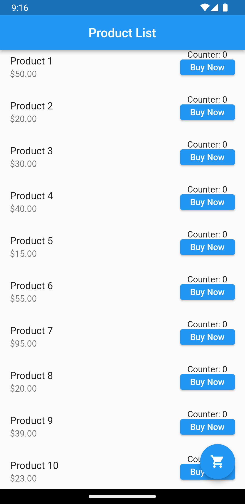
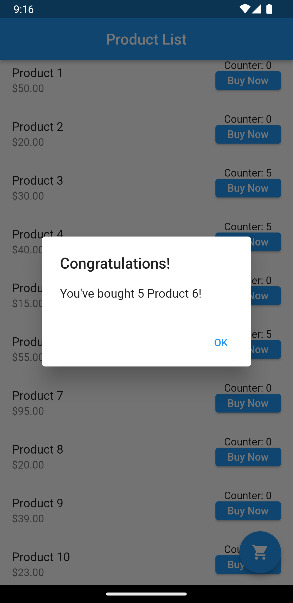

# module7_assignment
Create a Flutter application that consists of the following:

•       A stateful widget called ProductList that displays a list of products.

•       Each product should have a name, price, and a "Buy Now" button.

•       Implement a counter for each product that increments by 1 every time the "Buy Now" button is pressed.

•       When the counter for a product reaches 5, show a dialog box with the message "Congratulations! You've bought 5 {Product Name}!" Replace {Product Name} with the actual name of the product.

•       Use the ListView widget to display the product list.

•       Implement navigation to a new page called CartPage when the user presses a "Go to Cart" button. 

•       The CartPage should display the total number of products the user has bought.

     
    
